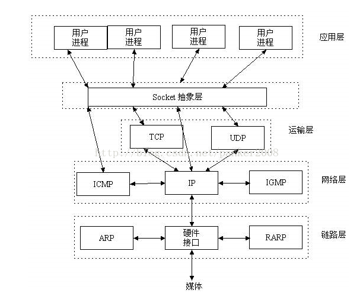
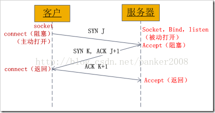
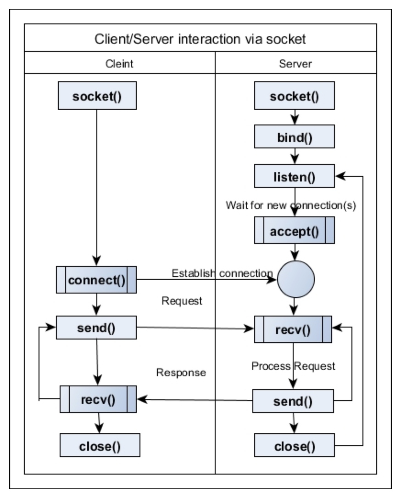

# socket

定义：进程间的网络通信。

交互过程：

理解socket抽象层在传输层和网络层之间的通信：类似于tcp的三次握手。

- Server:
    1. socket()
    2. bind()
    3. listen()
    4. accept()
    5. 已建立的连接
    6. recv()
    7. send()
    8. close()

- Client:
    1. socket()
    2. connect()
    3. send()
    4. recv()
    5. close()

socket三次握手：
