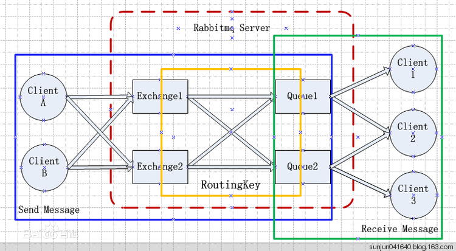

# rabbitMQ

定义：AMQP（即Advanced Message Queuing Protoco）协议的一种实现。

AMQP模型：

```shell
                +-+-+-+-+-+-+-+-+-+-+-+-+-+-+-+-+-+-+-+-+-+
                |                                         |
                |   +-+-+-+-+-+-+-+-+-+-+-+-+-+-+-+-+-|   |
                |   |                                 |   |  |
+-+-+-+-+-+-+   |   |   +-+-+-+-+-+-+     +-+-+-+-+-  |   |  |
| Publisher |---|---|---| Exchange  |-----{  Queue }--|---|--|
+-+-+-+-+-+-+   |   |    +-+-+-+-+--+     +-+-+-+-+-  |
                |   |    Virtual Host                 |
                |   +-+-+-+-+-+-+-+-+-+-+-+-+-+-+-+-+-|
                |       Broker                        |
                +-+-+-+-+-+-+-+-+-+-+-+-+-+-+-+-+-+-+-|

```

交互过程：

1. Broker（服务端）：实现消息队列和路由功能的路由。
2. VirtualHost:虚拟概念，类似于权限控制组，一个Virtual Host里面可以有若干个Exchange和Queue，当多个不同的用户使用同一个RabbitMQ server提供的服务时，可以划分出多个vhost，每个用户在自己的vhost创建exchange／queue等，就好比于tomcat中webapps目录下可以部署多个web项目
3. Exchange:接受生产者发送的消息，并根据Binding规则将消息路由给服务器中的队列，就好比邮递员。
4. Message Queue：消息队列，用于存储还未被消费者消费的消息，就好比于邮箱
5. Message: 由Header和Body组成，Header是由生产者添加的各种属性的集合，包括Message是否被持久化、由哪个Message Queue接受、优先级是多少等，就好比于邮箱里面的信件。而Body是真正需要传输的APP数据，就像信件里面的信纸。
6. Binding:Binding联系了Exchange与Message Queue。Exchange在与多个Message Queue发生Binding后会生成一张路由表，路由表中存储着Message Queue所需消息的限制条件即Binding Key。当Exchange收到Message时会解析其Header得到Routing Key，Exchange根据Routing Key与Exchange Type将Message路由到Message Queue。Binding Key由Consumer在Binding Exchange与Message Queue时指定，而Routing Key由Producer发送Message时指定，两者的匹配方式由Exchange Type决定，就好比于邮件上面的地址。
7. Connection:连接，对于RabbitMQ而言，其实就是一个位于客户端和Broker之间的TCP连接。
8. Channel:信道，仅仅创建了客户端到Broker之间的连接后，客户端还是不能发送消息的。需要为每一个Connection创建Channel，AMQP协议规定只有通过Channel才能执行AMQP的命令。一个Connection可以包含多个Channel。之所以需要Channel，是因为TCP连接的建立和释放都是十分昂贵的，如果一个客户端每一个线程都需要与Broker交互，如果每一个线程都建立一个TCP连接，暂且不考虑TCP连接是否浪费，就算操作系统也无法承受每秒建立如此多的TCP连接，可以简单的理解为线程池中的一个个线程。


RabbitMQ模型：



与websocket的比较：

- 同：
- 异：一次握手，多次通信。

应用场景：

需要解决,需求变更带来的扩展性问题，机器增减的可伸缩性，各功能组件的耦合性。